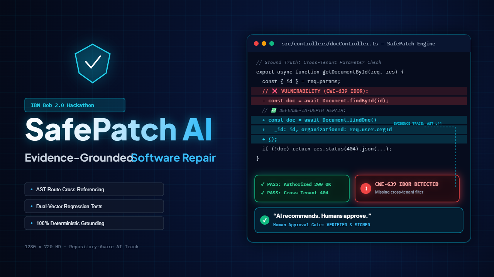

# SafePatch AI — Evidence-Grounded Software Repair

<p align="center">
  
</p>

<p align="center">
  <strong>AI recommends. Humans approve.</strong>
</p>

SafePatch AI is an AI-powered release-safety assistant that analyzes software repositories and reported bugs to identify root causes, generate regression tests, highlight security risks, and create an evidence-based repair plan before code changes are accepted.

## Problem

Fast bug fixes can introduce hidden regressions, authorization failures, missing tests, and new security vulnerabilities. Small engineering teams need a way to understand the full impact of a bug before approving a repair.

## Solution

SafePatch AI acts as a release-safety checkpoint. It analyzes repository structure, routes, controllers, bug reports, and security findings to produce:

- Evidence-grounded root-cause analysis
- File and line-level citations
- Security-risk classification
- Proposed repair plans
- Positive and negative regression tests
- Before/proposed-fix/after behavior comparison
- Human approval workflow
- Downloadable release-safety audit report

## Key Features

- Judge Demo Mode for one-click evaluation
- Repository-aware evidence analysis
- Cross-Tenant IDOR security demonstration
- AST route and controller cross-referencing
- CWE-639 and OWASP API risk identification
- Regression-test generation
- Behavior Comparison view
- Proof-of-Value metrics
- Human Approval Gate
- IBM Bob 2.0 development evidence
- Markdown audit-report export

## Demonstration Workflow

```text
Repository + Bug Report
          ↓
Repository Analysis
          ↓
Verified Evidence and Root Cause
          ↓
Repair Plan and Regression Tests
          ↓
Security Risk Review
          ↓
Human Approval
          ↓
Downloadable Audit Report
